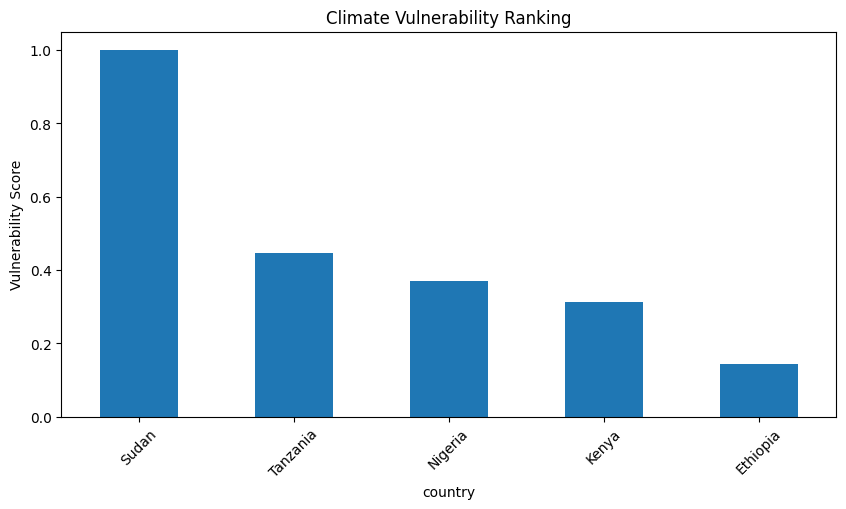

# 🌍 Climate Data Analysis for COP32

## 📌 Project Overview

This project analyzes daily climate data from five African countries — Ethiopia, Kenya, Nigeria, Sudan, and Tanzania — to assess climate patterns, detect extreme events, and evaluate relative climate vulnerability.

The goal is to generate **data-driven insights to support climate adaptation planning and financing decisions for COP32**.

---

## 🎯 Objectives

* Clean and preprocess multi-country climate datasets
* Perform exploratory data analysis (EDA) for each country
* Detect extreme climate events (heat and drought)
* Compare climate patterns across countries
* Build a **quantitative vulnerability ranking**
* Translate findings into **COP32-relevant policy insights**

---

## 🌍 Countries Analyzed

* Ethiopia
* Kenya
* Nigeria
* Sudan
* Tanzania

---

## 📊 Dataset Description

The dataset contains daily climate observations (2015–2026) with the following key features:

* `T2M` – Average temperature (°C)
* `T2M_MAX` – Maximum temperature (°C)
* `T2M_MIN` – Minimum temperature (°C)
* `PRECTOTCORR` – Precipitation (mm)
* `RH2M` – Relative humidity (%)
* `WS2M` – Wind speed (m/s)

---

## 🧹 Data Preprocessing

* Converted `YEAR` and `DOY` into datetime format
* Extracted time-based features (month, year)
* Replaced missing values (`-999` → NaN)
* Removed duplicates
* Standardized datasets across all countries

---

## 📈 Analysis Workflow

### 1. Country-Level EDA

* Temperature trends
* Rainfall patterns
* Seasonal variability
* Outlier detection

### 2. Cross-Country Comparison

* Average temperature comparison
* Extreme heat analysis (relative thresholds)
* Dry day frequency and drought analysis
* Longest dry spell detection

### 3. Vulnerability Assessment

A composite vulnerability score was calculated using:

* Temperature exposure
* Dry day percentage
* Maximum dry spell duration
      ## 📊 Climate Vulngit serability Visualization

         
---

## 🏆 Key Result: Climate Vulnerability Ranking

| Rank | Country  | Key Risk Drivers                         |
| ---- | -------- | ---------------------------------------- |
| 1    | Sudan    | Extreme heat + prolonged drought         |
| 2    | Tanzania | High temperature + moderate drought      |
| 3    | Nigeria  | High temperature, lower drought severity |
| 4    | Kenya    | Moderate drought, lower temperatures     |
| 5    | Ethiopia | Lower temperature, less extreme drought  |

👉 **Sudan emerges as the most climate-vulnerable country**, driven by:

* ~90% dry days
* Extremely long dry spells (~259 days)
* Highest average temperatures

---

## 🌐 Policy Implications for COP32

* **Sudan** requires urgent investment in:

  * Drought resilience
  * Water resource management
  * Heat mitigation strategies

* **Tanzania & Nigeria** need:

  * Climate variability management
  * Agricultural adaptation strategies

* **Ethiopia & Kenya** should focus on:

  * Strengthening resilience systems
  * Preventing future climate risk escalation

These insights support **evidence-based prioritization of climate finance and adaptation planning** at COP32.

---

## ⚙️ How to Run

### 1. Clone the repository

```bash
git clone https://github.com/hiwiy/climate-challenge-week0.git
cd climate-challenge-week0
```

### 2. Create and activate virtual environment

```bash
python -m venv venv
venv\Scripts\activate   # Windows
```

### 3. Install dependencies

```bash
pip install -r requirements.txt
```

### 4. Run the analysis

Open and run:

```text
notebooks/compare_countries.ipynb
```

---

## 📁 Project Structure

```text
climate-challenge-week0/
│
├── notebooks/
│   ├── ethiopia_eda.ipynb
│   └── compare_countries.ipynb
│
├── data/
│   └── processed/
│
├── requirements.txt
└── README.md
```

---

## 📄 Report

A full analysis report is included in the repository.

---

## 👤 Author

**hiwiy**
10 Academy — KAIM Program
